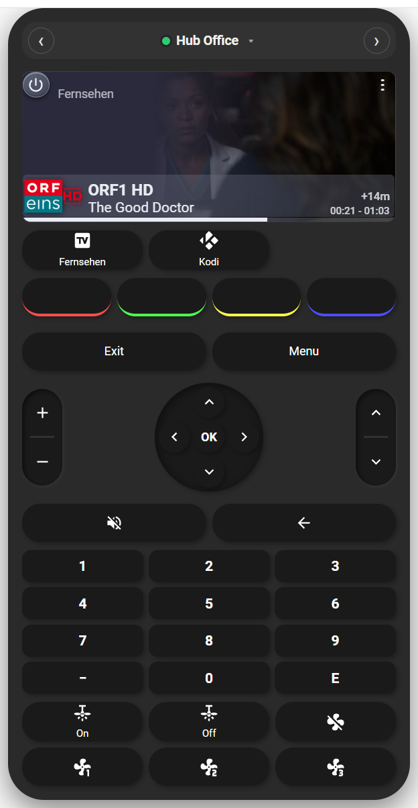
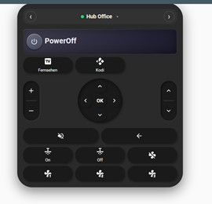
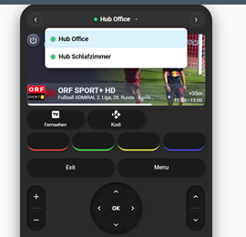
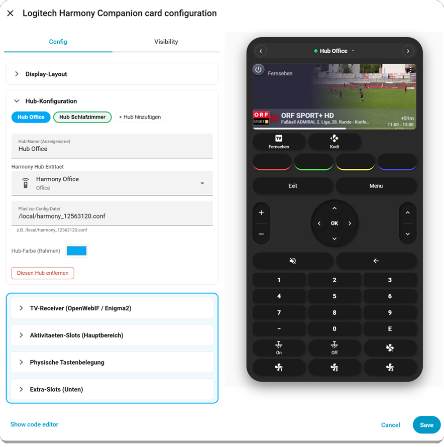
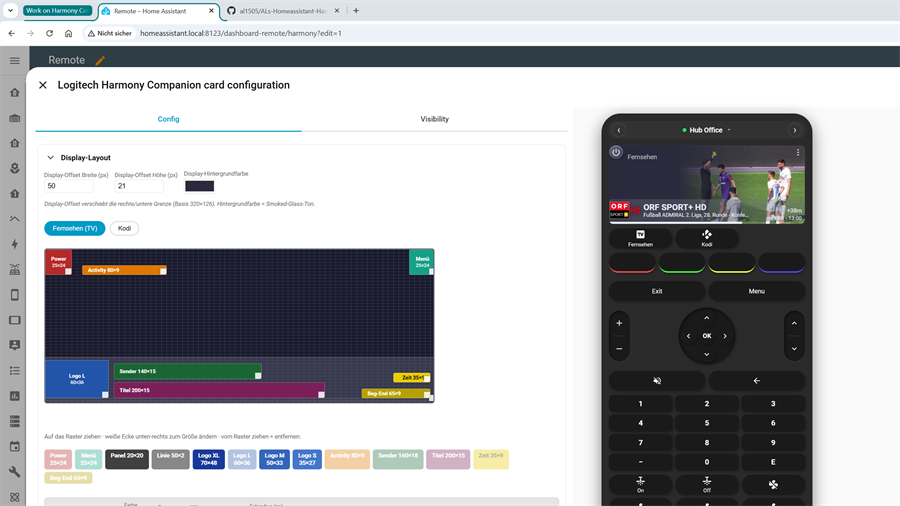
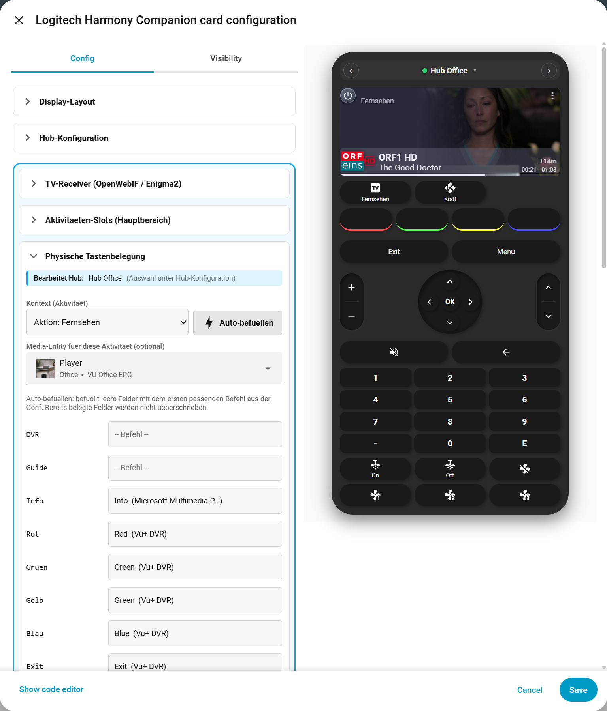

# ALs Homeassistant Harmony Companion Card

[](https://hacs.xyz)
[](https://github.com/al1505/ALs-Homeassistant-Harmony-Companion-Card/releases)
[](LICENSE)
[](https://paypal.me/al1505)

[](https://my.home-assistant.io/redirect/hacs_repository/?owner=al1505&repository=ALs-Homeassistant-Harmony-Companion-Card&category=plugin)

> **Lovelace Custom Card für Home Assistant — Digitaler Zwilling der Logitech Harmony Companion Fernbedienung**
> Mit visuellem Drag-and-Drop-Layout-Editor, Multi-Hub-Support (bis zu 5 Hubs), Smoked-Glass-Display, EPG-Integration und vielem mehr.

---

## 📱 Harmony Card V2 — Mobile-First (neu)

**`harmony-card-v2.js`** — eigenständige, mobile-first Variante für Pixel / Smartphone, **parallel zu V1** (beide koexistieren, V1 bleibt unverändert).

| Feature | V1 | V2 |
|---|---|---|
| Zielgerät | Desktop + Mobile | Mobile-first (Pixel 8 Pro) |
| Touch-Targets | 32–38 px | Activity ≥48 px · D-Pad ≥60 px |
| Device Quick Sheet | — | Gerät direkt steuern aus jeder Activity |
| Visueller Editor | Drag-and-Drop | — (YAML-Config, selbes Schema) |
| Multi-Hub | bis 5 | 1 Hub |
| EPG / Display | Smoked-Glass | — |
| Haptik | — | navigator.vibrate(30) |

**Setup (manuell):**
```yaml
# In HA → Einstellungen → Dashboards → Ressourcen hinzufügen:
# /local/community/harmony-companion-card/harmony-card-v2.js  (JavaScript Modul)
```
```yaml
# In der Lovelace-View:
type: custom:harmony-card-v2
entity: remote.harmony_hub
config_file: /local/harmony_12563120.conf   # selbe Conf wie V1
buttons:
  global:
    vol_up:    "command:::LG Fernseher:::VolumeUp"
    vol_down:  "command:::LG Fernseher:::VolumeDown"
    mute:      "command:::LG Fernseher:::Mute"
    dir_up:    "command:::LG Fernseher:::DirectionUp"
    dir_down:  "command:::LG Fernseher:::DirectionDown"
    dir_left:  "command:::LG Fernseher:::DirectionLeft"
    dir_right: "command:::LG Fernseher:::DirectionRight"
    ok:        "command:::LG Fernseher:::OK"
    back:      "command:::LG Fernseher:::Back"
    source:    "command:::LG Fernseher:::InputHdmi1"
  Fernsehen:
    ch_up:   "command:::LG Fernseher:::ChannelUp"
    ch_down: "command:::LG Fernseher:::ChannelDown"
  CODI:
    play:  "command:::Apple TV 4K:::Play"
    pause: "command:::Apple TV 4K:::Pause"
```

**Device Quick Sheet:** Tippe auf das Geräte-Symbol rechts in der Activity-Leiste → wähle ein Gerät → dessen konfigurierte Befehle erscheinen als Sheet. Ideal für TV-Source-Wechsel während einer anderen Activity aktiv ist.

---

## ☕ Support

Wenn dir diese Card gefällt und du die Weiterentwicklung unterstützen möchtest:

[](https://paypal.me/al1505)

Direkt-Link: **[paypal.me/al1505](https://paypal.me/al1505)** ❤️

---

## ✨ Features

- 🎮 **Vollständige Aktivitätssteuerung** über Harmony Hub (Activities, Devices, Commands)
- 📺 **TV-EPG-Integration** mit aktuellem Sender, Sendungstitel, Restzeit und Begin-/End-Anzeige
- 🖼️ **Live-Hintergrundbild** vom Receiver (OpenWebIF Grab-Bild)
- 🎨 **Visueller Drag-and-Drop-Layout-Editor** — alles ohne YAML-Editing positionierbar
- 📐 **Konfigurierbares Display-Offset** (Breite/Höhe per Slider/Eingabe)
- 🔌 **Multi-Hub-Support** — bis zu **5 Harmony Hubs** in einer einzigen Card-Instanz
- 👆 **Hub-Wechsel per Swipe-Geste** auf dem Display oder per Dropdown
- 🟢 **Live-Online-Status** pro Hub (grün/rot Punkt)
- 🌫️ **Smoked-Glass-Display** mit konfigurierbarer Farbe (Default `#2A2A3C`)
- 📦 **Multi-Instance Panels & Linien** mit Farbe, Transparenz, Rotation, Eckradius
- 🔤 **Per-Element Schriftart, -größe, -farbe** für alle Text-Elemente
- ⏱️ **Sofortiger EPG-Refresh** nach Kanalwechsel (kein Polling-Wait)
- 🎨 **Per-Hub konfigurierbare Farbe** (Rahmen + Hub-Bar Identity)

---

## 📸 Screenshots

<details open>
<summary><b>🎬 1. TV-Modus mit Live-EPG (ORF SPORT+ HD)</b></summary>



Card im aktiven TV-Modus: Live-Grab-Bild vom Receiver, Channel-Logo, Sender + Titel mit Restzeit (`+52m`) und Beg-End-Anzeige (`11:00 - 13:00`). Numpad, Farbtasten, D-Pad und Lautstärke/Kanal-Wippe sind eingeblendet.
</details>

<details>
<summary><b>🌓 2. Idle / PowerOff (Smoked-Glass-Display)</b></summary>



Im PowerOff-Zustand zeigt das Display den konfigurierbaren Smoked-Glass-Look (Default `#2A2A3C`). Panels, Linien, Logo und Menü werden komplett ausgeblendet — übrig bleiben nur Power-Button und Aktivitätsname.
</details>

<details>
<summary><b>🔌 3. Multi-Hub-Bar mit Dropdown</b></summary>



Multi-Hub-Auswahl oben in der Card: aktueller Hub mit grünem Online-Punkt, Pfeile links/rechts, Klick aufs Caret öffnet die Liste aller konfigurierten Hubs (hier "Hub Office" + "Hub Schlafzimmer" — beide online). Alternativ via Swipe-Geste auf der Display-Zone.
</details>

<details>
<summary><b>🎨 4. Editor mit per-Hub-Rahmen (Hub-Farben)</b></summary>



Editor mit Hub-Konfiguration aufgeklappt: Hub-Tabs in jeweiliger Farbe, Per-Hub-Bundle (TV-Receiver / Activities / Tasten / Extra-Slots) eingerahmt in der Hub-Farbe. Live-Preview rechts.
</details>

<details>
<summary><b>🖼️ 5. Visueller Display-Layout-Editor (Drag-and-Drop)</b></summary>



Vollständiger Drag-and-Drop-Layout-Editor: Display-Offset-Inputs, Smoked-Glass-Farbe, Element-Palette (Power, Menü, Panel, Linie, Logo XL/L/M/S, Activity, Sender, Titel, Zeit, Beg-End), Drag-and-Drop-Raster mit positionierten Elementen, Panel-Property-Editor (Farbe / Transparenz / Eckradius), Text-Element-Editor (Schriftgröße / Schriftart / Farbe), Übernehmen/Zurücksetzen.
</details>

<details>
<summary><b>⌨️ 6. Physische Tastenbelegung — pro Aktivität</b></summary>



Mapping zwischen den **physischen Buttons der Card** (DVR, Guide, Info, Farb-Tasten, Exit, Menü, OK-Pad, Volume/Channel, Numpad) und den **Befehlen, die der Harmony Hub sendet** — kontextabhängig je nach aktiver Aktivität.

**Konfigurierbar:**
- **Bearbeite Hub** — welcher Harmony Hub konfiguriert wird (Auswahl unter "Hub-Konfiguration")
- **Kontext (Aktivität)** — Dropdown mit drei Modi:
  - `Globale Standardbelegung` — Fallback wenn keine Aktivitäts-spezifische Belegung gesetzt ist
  - `Aktion: Fernsehen` — Mapping speziell für TV-Aktivität
  - `Aktion: Kodi` — Mapping speziell für Kodi (oder weitere Aktivitäten)
- **Auto-befüllen** — füllt leere Felder mit passenden Befehlen aus der Card-Definition; bestehende Einträge bleiben unangetastet
- **Media-Entity** *(optional)* — HA-Entity, deren Status im Display-Bereich angezeigt wird (z.B. der OpenWebIF-Player für TV-Stream/EPG)
- **Pro physische Taste ein Dropdown** — wählt den Hub-Befehl aus der `.conf`-Datei (Format: `Befehl (Gerät)`, z.B. `Red (Vu+ DVR)` oder `Volume Up (Sony AVR)`)

**Beispiel TV-Aktivität:**

| Card-Taste | Befehl |
|---|---|
| Rot / Grün / Gelb / Blau | `Red`/`Green`/`Yellow`/`Blue` (Vu+ DVR) — EPG-Navigation, Untertitel |
| DVR | `Record` (Vu+ DVR) |
| Guide | `EPG` (Vu+ DVR) |
| Info | `Info` (Vu+ DVR) |
| Exit / Menü | `Exit` / `Menu` (Vu+ DVR) |

**Pro-Aktivität-Override:** dieselbe rote Taste schickt bei `Fernsehen` z.B. `Red` an den Vu+, bei `Kodi` aber `Subtitles` an Kodi. Globale Standardbelegung gilt nur, wenn die aktive Aktivität kein eigenes Mapping definiert.
</details>

> 💡 **Eigene Screenshots beisteuern:** PR welcome — Bilder im Ordner `screenshots/` ablegen.

---

## 🚀 Installation

### Via HACS (empfohlen)

1. Auf den **HACS-Badge** oben klicken — oder manuell:
   - HACS → **Custom Repositories**
   - URL: `https://github.com/al1505/ALs-Homeassistant-Harmony-Companion-Card`
   - Kategorie: **Plugin**
2. Card installieren → HA neu starten
3. Lovelace Dashboard → **Karte hinzufügen** → **ALs Homeassistant Harmony Companion Card**

### Manuell

1. `harmony-companion-card.js` aus dem [Latest Release](https://github.com/al1505/ALs-Homeassistant-Harmony-Companion-Card/releases/latest) herunterladen
2. Datei nach `/config/www/community/harmony-companion-card/harmony-companion-card.js` kopieren
3. In Lovelace als Resource registrieren:
   ```yaml
   url: /local/community/harmony-companion-card/harmony-companion-card.js
   type: module
   ```
4. Card im Dashboard hinzufügen

---

## ⚙️ Konfiguration

### Minimal (Single-Hub Legacy)

```yaml
type: custom:harmony-companion-card
entity: remote.harmony_living
config_file: /local/harmony_living.conf
```

### Multi-Hub (v5+)

```yaml
type: custom:harmony-companion-card
# Globale Einstellungen (alle Hubs)
display_offset_w: 50
display_offset_h: 21
display_bg_color: "#2A2A3C"
tv_layout:    { ... }   # via Editor erstellt
media_layout: { ... }

# Pro-Hub-Konfiguration
hubs:
  - name: Wohnzimmer
    entity: remote.harmony_living
    config_file: /local/harmony_living.conf
    color: "#03a9f4"
    enigma2_entity: sensor.living_epg
    enigma2_activities: [Fernsehen]
    activity_media:
      Fernsehen: media_player.vu_living
    buttons:
      global: { vol_up: 'command:::DEVICE_ID:::VolumeUp', ... }
      Fernsehen: { ... }
    dynamic_slots:
      act_1: { text: TV, icon: mdi:television, action: 'activity:::Fernsehen' }

  - name: Schlafzimmer
    entity: remote.harmony_bedroom
    config_file: /local/harmony_bedroom.conf
    color: "#27ae60"
    # ... eigene Settings
```

> 💡 **Empfehlung:** Komplette Konfiguration über den **visuellen Editor** statt YAML — zugänglich via Dashboard → Karte bearbeiten → Konfiguration.

---

## 🔗 Dependencies

| Komponente | Pflicht | Zweck |
|------------|---------|-------|
| Home Assistant | ✅ ab 2024.1.0 | Basis |
| Logitech Harmony Hub | ✅ | Steuerung der Geräte |
| HA Harmony Integration | ✅ | Hub-Anbindung an HA (`remote.*` Entitäten) |
| `.conf`-Datei pro Hub | ✅ | Geräte-Befehlsliste (export aus Harmony-App) |
| [ALs Homeassistant Enigma2 EPG](https://github.com/al1505/als-enigma2-epg) | optional | EPG-Daten (Kanal, Titel, Restzeit) für Enigma2-Receiver |
| OpenWebIF | optional | Grab-Bild + Picon-URL (über Enigma2-EPG) |

---

## 📜 Versionshistorie

### v5.x — Multi-Hub & Smoked-Glass-Era

| Version | Highlights |
|---------|-----------|
| **v5.3.2** | 🐛 Smoked-Glass-Bugfix (LCD_BG-Override entfernt), Power-Button mit solidem grauem Verlauf |
| **v5.3.1** | Hub-Banner in Hub-Farbe, konfigurierbare Display-BG, Power-Button-Optik, Dropdown-Stability-Fix |
| **v5.3.0** | Smoked-Glass-Display, Idle versteckt Panels/Linien/Logo/Menü, Editor-Reorder, Hub-Farben |
| **v5.2.0** | **Per-Hub-Konfiguration**: TV-Receiver, Activities, Slots, Buttons jetzt PRO Hub. Display-Layout bleibt global |
| **v5.1.0** | **Multi-Hub-Support**: bis zu 5 Hubs, Hub-Bar oben mit Dropdown + Online-Status, Swipe-Geste, Editor mit Hub-Tabs |
| **v5.0.0** | Start v5-Entwicklungslinie (Basis v4.9.1) |

### v4.x — Visual-Editor-Era

| Version | Highlights |
|---------|-----------|
| **v4.9.1** | EPG-Refresh nach Kanalwechsel (verzögerter `homeassistant.update_entity`-Trigger) |
| **v4.9.0** | **Text-Element-Editor** (Schriftgröße/-art/-farbe pro Element), stärkeres Selection-Highlight, Frozen-Object-Fix |
| **v4.8.x** | **Linien-Element** mit Rotation, Slider-Drag-Fix, Transparenz-Slider invertiert |
| **v4.7.0** | **Mehrere Panels** (`panel_1`, `panel_2`, ...) mit nachträglicher Bearbeitung |
| **v4.6.x** | **Panel-Element** (Hintergrund-Box mit Farbe/Alpha/Eckradius) |
| **v4.5.x** | Konfigurierbare Display-Offsets, Burger-Menü-Element |
| **v4.4.x** | Element-Größen-Updates, +20px Display-Offset, "Übernehmen"-Button (Auto-Save raus) |
| **v4.3.x** | Logo M, neue Default-Größen, Bottom/Right-Anchoring entfernt — keine Sprünge mehr |
| **v4.2.0** | Zeit-Format `+109m`, neues "Beg-End"-Element |
| **v4.1.0** | **Resize-Funktion** für Editor-Elemente (Ecken-Handle) |
| **v4.0.x** | **Visueller Drag-and-Drop Layout-Editor** ersetzt statische `[data-layout]`-CSS |

### v3.x — TV-Display-Era

| Version | Highlights |
|---------|-----------|
| **v3.21.x** | Display-Höhe `126px !important`, Kodi-Media-Mode mit Titel/Zeit unten-links |
| **v3.20.x** | Bottom-Row-Clearance, Uhr-Suffix, Transition-Fix |
| **v3.19.x** | URL-Feld + Camera entfernt, Layout-Refactoring |
| **v3.10–18** | TV-Display, EPG-Integration (3 Layouts), Picon-URL, Channel-Color-Extraction, Restzeit-Anzeige |

> 📋 Vollständige Release-Notes: [GitHub Releases](https://github.com/al1505/ALs-Homeassistant-Harmony-Companion-Card/releases)

---

## 🏗️ Architektur

- **Shadow-DOM-Isolation** für Card, **Light-DOM** für Editor (HA-Selectors funktionieren nur im Light-DOM)
- **Modulare 7-Säulen-Struktur**: SETUP, FRONTEND, LOGIC, INTEGRATION, HELPERS, REFRESH, DATA
- **Backward-Compatibility**: Single-Hub-Configs ohne `hubs[]` werden weiterhin als Hub 1 erkannt
- **Immutable Updates**: Property-Editoren nutzen Spread-Operator → keine Frozen-Object-Errors mehr
- **Center-anchored Coordinates**: keine Sprünge beim Verschieben über Display-Mittellinie
- **Multi-Instance Pattern** (`panel_N`, `line_N`): dynamische DOM-Erstellung in `_applyDisplayLayout`

Mehr Details: siehe [`HA-ARCHITECTURE.md`](../HA-ARCHITECTURE.md) (strikte Mandate), [`HA-COOKBOOK.md`](../HA-COOKBOOK.md) (Setup-Rezepte) und [`HA-RETROSPECTIVE.md`](../HA-RETROSPECTIVE.md) (Lessons Learned) im Workspace.

---

## 🛠️ Entwicklung

```bash
# Repo klonen
git clone https://github.com/al1505/ALs-Homeassistant-Harmony-Companion-Card.git
cd ALs-Homeassistant-Harmony-Companion-Card

# Datei direkt nach HA kopieren (Symlink für Live-Reload empfohlen)
cp harmony-companion-card.js /config/www/community/harmony-companion-card/

# Browser Hard-Refresh (Ctrl+Shift+R) — HA cached die JS-Datei
```

**Versions-Tag = Release**: jeder Tag wird automatisch als GitHub Release publiziert (inklusive `harmony-companion-card.js` als Asset).

---

## 📄 Lizenz

MIT License — siehe [LICENSE](LICENSE)

---

## 🙏 Danke

Wenn dir die Card im Alltag hilft → freue ich mich über einen kleinen Kaffee:

[](https://paypal.me/al1505)

**[paypal.me/al1505](https://paypal.me/al1505)** ☕

---

*Entwickelt mit ❤️ von [al1505](https://github.com/al1505)*
